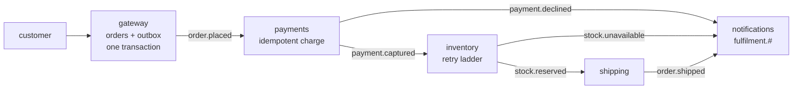

# apps/01 — order fulfilment, in VB.NET

Five services, one broker, no shared database, and no service that knows another
exists.

Everything under `basic`, `intermediate` and `advanced` demonstrates one idea at a
time. This is what they look like when they have to coexist: an outbox at the
edge, idempotency where double-charging is real harm, a retry ladder where a
downstream is flaky, and one correlation id that turns five services into one
story.

It is a port of the Java examples'
[apps/01-order-fulfilment](https://github.com/AceMQ-Company/acemq-java-amqp-examples/tree/main/apps/01-order-fulfilment):
the same services, the same events, the same four orders and the same checks. The
same app exists in C# at [apps/01-order-fulfilment-csharp](../01-order-fulfilment-csharp).

## The flow



Each service owns one decision and publishes what happened. None of them calls
another.

| Service | File | The pattern | Why it lives there |
|---|---|---|---|
| **gateway** | [Gateway.vb](Gateway.vb) | Transactional outbox | The edge is where the dual-write problem lives: save the order *and* announce it, or a crash loses one of them |
| **payments** | [Payments.vb](Payments.vb) | Shared idempotency store | The only service where handling a message twice is real money. Claims before charging, confirms after publishing |
| **inventory** | [Inventory.vb](Inventory.vb) | Retry ladder | Tells "the warehouse timed out" (retry) from "there are three left and they want ten" (an answer, published at once) |
| **shipping** | [Shipping.vb](Shipping.vb) | Nothing clever | The point: it reacts to one event, does one thing, publishes one event |
| **notifications** | [Notifications.vb](Notifications.vb) | Topic wildcard | Bound to `fulfilment.#`. Added without touching a single publisher |

[Contracts.vb](Contracts.vb) is everything they agree on and nothing else, and
[Program.vb](Program.vb) is the Java app's system test: it starts all five,
puts the orders through, and checks.

## Running it

```bash
docker compose up -d
dotnet run --project apps/01-order-fulfilment-vbnet
```

It takes about three seconds. Each of the four orders gets a freshly started
system and an empty broker, as each Java test does, and the process exits
non-zero if any check did not hold.

## What to look for

```
          ord-20b39bd9: OrderPlaced -> PaymentCaptured -> StockReserved -> OrderShipped
held      an order travels through every service
          ord-c3b16aa0: OrderPlaced -> PaymentCaptured -> StockReserved -> OrderShipped
held      a flaky warehouse is retried rather than failed
          ord-d7467819: OrderPlaced -> PaymentDeclined
held      an order over the limit stops at payments
          ord-b23f7659: OrderPlaced -> PaymentCaptured -> StockUnavailable
held      there is not enough stock, and retrying would not help
all four held
```

**Each timeline is built from nothing but the correlation id.** Four services that
never spoke to each other, assembled into one sequence by notifications. Drop the
`CorrelationId(...)` from any one publish and that order vanishes from its own
timeline — which is also what happens to traces and log correlation in production.

**The second order's timeline is identical to the first.** The warehouse failed
twice on the way, and nothing downstream can tell: the retries happened inside
inventory's consumer and only the success was published.

**The last one took the money.** When stock runs out the customer has already been
charged, and the run checks exactly that. A real system triggers a refund here;
the app leaves it visible rather than pretending the problem does not exist. That
compensation is what [a saga](../../intermediate/04-saga-vbnet) would add.

Beyond the Java app's own assertions, every order is also checked for what it must
**not** leave behind: nothing in any service's `.dlq` or `.parked` queue, and no
order offered to payments twice. A library that lost or duplicated a message on
one of these paths would fail here even when the counts it was asked about came
out right.

## Where it differs from the Java app, and why

**Broker names carry a prefix.** The exchange is `dotnet-vbnet.fulfilment` and
the queues are `dotnet-vbnet.fulfilment.payments` and so on. The C# and VB.NET
apps run against one broker in CI, and the same app in other languages can share
a fault-drill cluster with them; two apps reading one `fulfilment.payments` would
each take half of the other's orders. Routing keys (`fulfilment.order.placed` …)
and envelope types (`OrderPlaced` …) are the Java app's exactly, and so are the
payload field names — the JSON codec camelCases, so `OrderId` is `orderId` on the
wire, from these classes as from the C# twin's records. That makes the contracts
identical by construction; a Java service and a .NET one have not been run
against each other here, so this README does not claim that they interoperate.

**The outbox payload is encoded by the library.** The Java gateway writes the
`OrderPlaced` JSON by hand. `OutboxRecord.For` encodes with the connection's codec
instead — the codec the consumer reads with — so a typo in hand-written JSON
cannot become a message nothing can decode.

**Payments gives its claim back when publishing fails.** The Java service keeps
it. The retry that failure asks for then finds the claim still held, is refused
as a duplicate and acknowledged — the order stops, charged by nobody and with
nobody told, until the two-minute lease would have let it through. Released, the
retry can take it.

**The retry ladder waits in the consumer, not in the broker.** Java waits every
rung in a delay queue. This library waits a rung shorter than
`RetryPolicy.DefaultBrokerWaitThreshold` (thirty seconds) on the consumer and only
longer ones in the broker, so every rung of this 200 ms ladder is an in-process
wait. The attempt count still travels on the message either way.

**Retries are counted from what arrived.** Java's consumer has a `retried()`
counter; the .NET one does not, so inventory counts deliveries whose
`message.Attempt` is above one — which also catches a retry that was scheduled
and never came back.

**The fan-in codec is called `string`.** Java and Python register the text codec
as `text`; this library and Ruby's register it as `string`, and
`CodecRegistry.ByName("text")` is refused. The name is the only difference: it
hands the body over as a `String` without trying to read it as JSON.

**The databases are SQLite files.** The Java test uses H2 in memory. SQLite's
shared in-memory mode locks per table and fails at once rather than waiting,
and the outbox relay polls while an order is being written — so each service
gets a temporary file of its own, deleted at the end.

## What porting it found in the library

Worth recording, because it is the argument for building applications rather
than only examples.

**A claim that failed was read as a duplicate.** `DbIdempotencyStore.ClaimAsync`
claims by inserting a row and took *any* database error on that insert to mean
the primary key had refused it. A lock timeout or a deadlock therefore answered
`false`, and payments would have counted a duplicate and acknowledged an order it
never charged — nothing dead-lettered, nothing logged. Java's store asks whether
the row is really there before saying so, and since the release after 0.7.7 the
.NET one does too; until then a failed insert is a lost message. Every order in
this run checks `DuplicatesRefused` is zero, which is where it would show.

## What VB.NET changes

**No `Await` in a `Catch` or a `Finally`.** Payments releases its claim when a
publish fails, and releasing is an `Await` — so the exception is caught into an
`ExceptionDispatchInfo`, the claim released after the `Try`, and the exception
rethrown with its original stack. The run itself stops each system the same way:
a scenario's failure is kept, the system is stopped, and only then reported.

**No `await using`.** Every service closes with `CloseAsync()`, which drains its
handlers and returns a `Task`, because VB.NET can neither write `await using` nor
`Await` the `ValueTask` that `DisposeAsync` returns.

**Case-insensitivity reaches further than it looks.** The contract is a class of
`Shared` members rather than a `Module`, because a module's members are in scope
everywhere without qualification and a constant called `Payments` would meet
every `payments` in the project. The system under test is a local called
`running`, because one called `system` hides the `System` namespace for the
whole function.

**Events are classes, not records.** VB.NET has no positional records, so each
event is a class with settable properties — which `System.Text.Json` reads into
and writes from exactly as it does the C# records.

## Design decisions worth arguing with

**A database per service.** The moment two services read the same table, the
deployment boundary is fiction. The gateway and payments each get their own.

**Every service applies the whole topology on start-up.** Applying it five times
is safe, and it means no service depends on another having started first.

**Payments runs before inventory.** Reserving stock for an order that cannot be
paid for is how a warehouse fills with holds nobody releases.

## What is deliberately not here

No HTTP. The gateway exposes `PlaceOrderAsync(...)` as a method, because adding a
web framework would triple the code and demonstrate nothing about messaging.

No compensation. The refund path is named and not implemented.

## Related

- [basic/05](../../basic/05-transactional-outbox-vbnet) — the outbox on its own
- [basic/03](../../basic/03-idempotent-consumer-vbnet) — one message delivered four times and charged once
- [basic/02](../../basic/02-retries-and-dead-letters-vbnet) — the retry ladder
- [intermediate/09](../../intermediate/09-telemetry-vbnet) — the trace this correlation id enables
