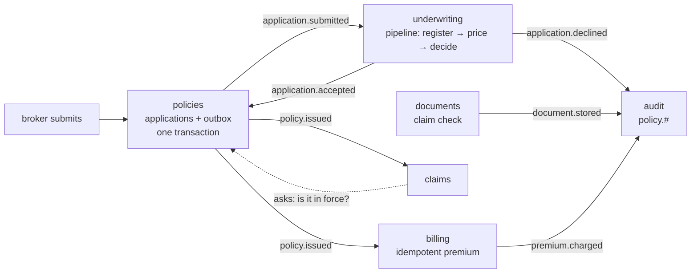

# apps/02 — policy administration, in VB.NET

One deployable, six modules, one database, and no module that calls another.

[apps/01](../01-order-fulfilment-vbnet) is five services that cannot call each
other because a network is in the way. This is the same discipline with the
network removed: the modules run in one process, share one database and one
connection, and still communicate only by publishing events.

**A modular monolith is not a step towards microservices.** It is a different
answer to the same question, and for most organisations the better one: module
boundaries without distributed transactions, independent reasoning without
independent deployment, and one database you can actually join across.

It is a port of the Java examples'
[apps/02-policy-administration](https://github.com/AceMQ-Company/acemq-java-amqp-examples/tree/main/apps/02-policy-administration):
the same modules, the same events, the same five scenarios and the same checks.
The same app exists in C# at
[apps/02-policy-administration-csharp](../02-policy-administration-csharp).

## The flow



The dotted line is the only one that is not an event: claims **asks** policies a
question and waits for the answer.

| Module | File | The pattern | Why it lives there |
|---|---|---|---|
| **policies** | [Policies.vb](Policies.vb) | Transactional outbox | One database does *not* remove the dual write. The two systems that must agree are this database and the broker, and no transaction spans both |
| **underwriting** | [Underwriting.vb](Underwriting.vb) | Pipeline | The one genuinely sequential part: check the register, price it, decide. A queue per stage, so a slow stage is a deep queue you can point at |
| **documents** | [Documents.vb](Documents.vb) | Claim check | A scanned medical report is tens of megabytes. The store gets the bytes; the message gets the key |
| **billing** | [Billing.vb](Billing.vb) | Shared idempotency store | The only module where handling a message twice is money |
| **claims** | [Claims.vb](Claims.vb) | Request/reply | Needs an answer *now*, before settling. Asks over the broker even though the callee is in the same process |
| **audit** | [Contracts.vb](Contracts.vb) | Topic wildcard | A queue bound to `policy.#`. Every event, including ones not invented yet |

[Contracts.vb](Contracts.vb) is everything the modules agree on and nothing else,
and [Program.vb](Program.vb) is the Java app's system test: the only file that
names more than one module.

## The outbox is still necessary

```vb
Using transaction = connection.BeginTransaction()
    Execute(connection, transaction, "INSERT INTO applications ...")   ' this database
    Await _outbox.AddAsync(OutboxRecord.For(...), transaction)         ' the same transaction
    transaction.Commit()                                               ' one decision, both writes
End Using
```

A monolith removes the distributed transaction *between modules*. It does nothing
about the one between a module and its broker. Save the application and publish
the event without an outbox, and a crash between them still loses one of the two.

## Why claims asks instead of reading

```vb
status = Await _requester.RequestAsync(Of PolicyQuery, PolicyStatus)(
    "", Policies.PolicyLookup, New PolicyQuery With {.PolicyId = policyId},
    LookupTimeout, CancellationToken.None)
```

The moment claims calls into policies directly, the two are one module and no
folder structure will separate them again. Asking over the broker costs a
millisecond and keeps the seam that makes this arrangement worth having.

When the timeout expires the claim is **neither settled nor rejected**. A lookup
that did not answer is not a "no", and treating it as one would refuse valid
claims whenever the application was busy.

## Running it

```bash
docker compose up -d
dotnet run --project apps/02-policy-administration-vbnet
```

It takes about ten seconds. Each scenario gets a freshly started application, a
fresh database and an empty broker, as each Java test does, and the process exits
non-zero if any check did not hold.

```
held      an ordinary application becomes a policy, and the premium is taken once
held      an application above the automatic limit is referred, and never becomes a policy
held      a claim is assessed against an answer from policies, not against a local copy
held      a large document travels as a claim check, not as a message
held      three copies of one event charge once; a genuinely different event still charges
all five held
```

Beyond the Java test's own assertions, every scenario also checks what it must
leave behind. **The audit queue holds exactly the events the scenario
published** — four for the happy path, eight for the idempotency scenario (the
original four, three copies of `PolicyIssued`, and the one charge they made) — so
a lost message is one short and a duplicated one is one over. Nothing is in any
module's `.dlq` or `.parked` queue, the outbox is empty, and no lookup timed out.

Take the idempotency store off billing and the last scenario fails: four charges
where there should be two.

## Where it differs from the Java app, and why

**Broker names carry a prefix.** The exchange is `dotnet-vbnet.policy`, the
queues `dotnet-vbnet.policy.billing` and so on, and the pipeline's stages
`dotnet-vbnet.underwriting.register`, `.price` and `.decide`. The C# and VB.NET
twins share one broker in CI. Routing keys (`policy.policy.issued` …) and
envelope types (`PolicyIssued` …) are the Java app's exactly, and the JSON codec
camelCases, so the payload field names match too — from these classes as from
the C# twin's records. That makes the contracts
identical by construction; a Java module and a .NET one have not been run against
each other here, so this README does not claim that they interoperate.

**The module boundary is a convention, not a build.** Java puts each module in
its own Maven module depending only on `contracts`, so reaching into a sibling
does not compile. Here the modules are files in one project and nothing but
discipline stops it. Splitting them into one project each would restore the
compile-time boundary; the repository's one-directory-per-example layout is why it
is not done here.

**The pipeline's stages are not described.** Java's builder takes
`.describedAs("look the applicant up on the shared industry register")` and logs
it at start-up. The .NET `PipelineBuilder` has no equivalent, so the descriptions
are comments in [Underwriting.vb](Underwriting.vb).

**The retry policy covers every stage.** Java attaches it to `register` alone.
The .NET builder takes one policy for the whole pipeline, so `price` and `decide`
have it too; neither of them fails, so nothing observable changes.

**Documents is hand-rolled, though the library has a claim check.** AceMq.Amqp
ships `IClaimCheckStore` and a `ClaimCheckCodec` that does this transparently for
any payload over a threshold. The module keeps the Java shape anyway, because
its key says what it is — `doc/{policy}/{kind}/{id}`, which the scenario checks —
where the library's key is opaque.

**Counted after publishing, not before.** Java's modules increment their counters
and then publish. Here the publish comes first, so a publish that failed and was
retried is not counted twice.

**One SQLite file instead of H2 in memory**, in write-ahead mode because three
modules write to it at once, deleted at the end.

## What VB.NET changes

**No `Await` in a `Catch` or a `Finally`.** Each scenario's failure is caught into
a local, the application is stopped — an `Await` — and only then is the failure
reported. Every module closes with the connection's `CloseAsync()` rather than
`await using`, which VB.NET cannot write.

**Case-insensitivity reaches further than it looks.** The contract is a class of
`Shared` members rather than a `Module`, because a module's members are in scope
everywhere and a constant called `Billing` would meet every `billing` in the
project. Each module's `StartAsync` calls its new instance `started`, because one
called `policies` hides the `Policies` contract for the whole method. And inside
the application class, where `Policies` is a property, the topology is reached as
`Global.AceMq.Examples.Policies.Everything()`.

**Events are classes, not records.** VB.NET has no positional records, so each
event is a class with settable properties — which `System.Text.Json` reads into
and writes from exactly as it does the C# records.

## Related

- [apps/01](../01-order-fulfilment-vbnet) — the same discipline across five processes
- [basic/05](../../basic/05-transactional-outbox-vbnet) — the outbox on its own
- [basic/03](../../basic/03-idempotent-consumer-vbnet) — one message delivered four times and charged once
- [intermediate/03](../../intermediate/03-request-reply-vbnet) — request/reply on its own
- [intermediate/08](../../intermediate/08-pipelines-vbnet) — pipelines on their own
