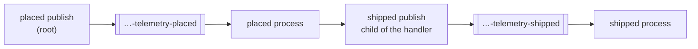

# intermediate/09 — one trace across the broker, and the metrics a scrape sees, in C#

An order is placed, a handler ships it by publishing again, and a second handler
hears about the shipment. Four operations and two trips through the broker land
in **one** trace — and then the same traffic is scraped as Prometheus metrics,
over HTTP, and checked against what actually happened.

The same example exists in VB.NET at
[intermediate/09-telemetry-vbnet](../09-telemetry-vbnet).

## What it shows

- **Tracing is the OpenTelemetry SDK's job, not an AceMQ API.** The library's
  spans come from an `ActivitySource` named `AceMq.Amqp`, and `AddSource` is the
  whole of the wiring.
- **The trace crosses the broker.** The context travels as a W3C `traceparent`
  header and each consumer's span continues the trace that sent the message.
- **A publish inside a handler joins that handler's trace**, which is what makes
  a multi-service flow one picture instead of several.
- **The join is checked link by link**, not only by counting trace ids.
- **Prometheus metrics with no OpenTelemetry exporter at all**: `AceMqActuator`
  from `AceMq.Amqp.Diagnostics` serves them, and health, on a port of its own.



## Running it

```bash
docker compose up -d
dotnet run --project intermediate/09-telemetry-csharp
```

It takes about a second. The actuator listens on `localhost:9471` while it runs.

## What to look for

```
dotnet-csharp-telemetry-placed publish   confirmed 87838ed42a3d45b189b09f58041cda2d  parent=(root)
dotnet-csharp-telemetry-placed process   acked     87838ed42a3d45b189b09f58041cda2d  parent=375abb43dda75423
dotnet-csharp-telemetry-shipped publish  confirmed 87838ed42a3d45b189b09f58041cda2d  parent=6e198216d4f2885b
dotnet-csharp-telemetry-shipped process  acked     87838ed42a3d45b189b09f58041cda2d  parent=bb2c406293e11a17

spans 4, traces 1, roots 1
o-1 arrived carrying traceparent 00-87838ed42a3d45b189b09f58041cda2d-375abb43dda75423-01

acemq_consume_duration_seconds_count{message_type="dotnet-csharp-telemetry-placed",outcome="acked",queue="dotnet-csharp-telemetry-placed"} 1
acemq_consume_duration_seconds_count{message_type="dotnet-csharp-telemetry-shipped",outcome="acked",queue="dotnet-csharp-telemetry-shipped"} 1
acemq_consume_total{message_type="dotnet-csharp-telemetry-placed",outcome="acked",queue="dotnet-csharp-telemetry-placed"} 1
acemq_consume_total{message_type="dotnet-csharp-telemetry-shipped",outcome="acked",queue="dotnet-csharp-telemetry-shipped"} 1
acemq_publish_total{exchange="",message_type="dotnet-csharp-telemetry-placed",outcome="confirmed",routing_key="dotnet-csharp-telemetry-placed"} 1
acemq_publish_total{exchange="",message_type="dotnet-csharp-telemetry-shipped",outcome="confirmed",routing_key="dotnet-csharp-telemetry-shipped"} 1

200 {"status":"UP","inFlight":0,"components":{"connection":{"status":"UP","open":"true","blocked":"false","transport":"rabbitmq","inFlight":"0","held":"0"}}}
```

Ids differ every run. What does not: four spans, **one** trace id, and exactly
one root. Read the parents down the column — each one is the span on the line
above, so the trace says who caused whom and not only that they were related.

The `traceparent` line is the mechanism made visible: `00-<trace id>-<span
id>-01`, and the trace id and span id are exactly the first publish's. That is
the W3C format, so a Java, Go, Python or Ruby consumer reading this message joins
the same trace.

## The library never depends on OpenTelemetry

```csharp
using var tracing = Sdk.CreateTracerProviderBuilder()
    .AddSource(MetricNames.ActivitySource)
    .AddInMemoryExporter(spans)
    .Build();
```

`AceMq.Amqp` records to `System.Diagnostics.ActivitySource` and
`System.Diagnostics.Metrics.Meter` — the runtime's own APIs — and references no
OpenTelemetry or Prometheus package. The application owns its SDK and its
version, so adopting the library never means resolving a version conflict with
one. The two OpenTelemetry packages in this project file are the example's
choice, not something AceMQ brought in.

A real service swaps `AddInMemoryExporter` for an OTLP exporter, and nothing else
changes. An `ActivityListener` with no SDK at all would work too.

## Why the publish inside the handler matters

The handler's span is `Activity.Current` while the handler runs, so a publish
made from inside it becomes its child — the `shipped publish` line names the
`placed process` span as its parent. Without that, a flow through two services is
two traces that a reader has to stitch together by timestamp, which is a guess.

The first consumer's parent did **not** come from ambient context. It came off the
message. A delivery's real parent is in another process, possibly minutes ago,
and nothing on the thread that receives it remembers that.

## Metrics without an exporter

```csharp
using var actuator = AceMqActuator.Start(mq, new ActuatorOptions { Port = MetricsPort });
```

`AceMqActuator` serves `/acemq-metrics` in the Prometheus text format,
`/acemq-health` as JSON, and `/acemq-info`. It is built on `MeterListener` and
`HttpListener`, so it has no OpenTelemetry or ASP.NET Core dependency and runs
on everything the library runs on — including .NET Framework, which the
OpenTelemetry Prometheus exporters cannot reach. An ASP.NET Core service would
generally let the OpenTelemetry SDK own the exporter instead; this is for the
applications that cannot.

Two things worth knowing about it:

- **It counts from when it starts.** Start it before any traffic, or the first
  scrape misses whatever came first. A process restart resets the counters, which
  Prometheus expects and detects.
- **It binds to `localhost`, and should stay there.** The endpoints are not
  authenticated, and they name every queue and its traffic. Let the scraper reach
  it through the same host, a sidecar, or a network policy rather than binding to
  `0.0.0.0`.

The health endpoint answers 503 only when the connection is actually down. A
broker applying back pressure is reported as `UP` with the reason — see
[advanced/03](../../advanced/03-health-and-back-pressure-csharp) for why.

## How this stays honest

The example asserts four spans in one trace with exactly one root, each parent
being the span that caused it, the `traceparent` on the wire naming the first
publish exactly, and an outcome on every span.

It scrapes the actuator over HTTP rather than calling `Metrics()`, because the
endpoint and its content type are what a scrape job depends on — Prometheus
refuses a scrape without `text/plain; version=0.0.4`. It asserts exactly one
confirmed publish, one acknowledged delivery and one timed handler per queue —
a counter reading two here counts something twice, and every rate built on it
would be doubled — and that health answers 200 and `UP`. The example exits
non-zero if any of them is wrong.
